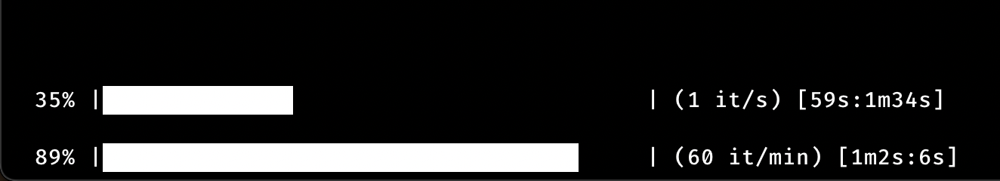

# check-human-pulse

Check your pulse quickly & easily on a CLI, by pressing any key for each pulse you feel.

While counting:


Once finished:


### Usage

It will wait until you press any key to start counting, and automatically stop counting after 60 seconds by default, or after 200 beats.

You can also press <kbd>Enter</kbd> to finish counting early.

You can reasonably get a fairly accurate pulse in only ~15-25 seconds if you're confident in your ability to feel it, it's just a learned skill which you can get a feel for.

```
make
./check-human-pulse

# Automatically stop after 15 seconds, instead of the default 60:
./check-human-pulse -s 15
```

### TODO

- [ ] Fix progress bars breaking when waiting too long? Idk what happened here, it worked earlier
- [x] <s>Fix terminal newlines and so on being weird after the program closes, requiring you to refresh your prompt / rc</s>
- [ ] Uhhh display current BPM, maybe nicer displays? I would like it to be more compact and visually appealing
- [ ] Maybe some kind of fun meter displaying a range of what your current BPM means, maybe view historic results?
- [ ] Automatically saving results to a spreadsheet or some kind of way to save and export them would be cool
